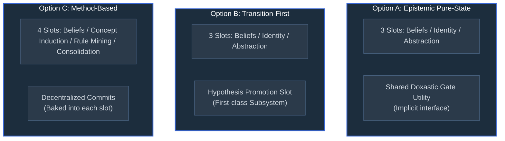

# Task #82: "Learn" Operationalization — Architectural Options Analysis

This document records the architectural evaluation of the "Learn" operationalization slots for the Droidoes Obsidian-KDB project. It analyzes the boundary between **Analysis** and **Learn** operations and proposes three distinct structural options to resolve how hypothesis promotion (the "commit-back" gate) should be organized in the pipeline.

---

## 1. The Epistemic Frame

Per the cross-model consensus synthesized in `docs/what-is-the-ontology-for.md` §9.3, the project locks the following definitions:

*   **Remember (Retrieval)**: Reading/traversal over a frozen graph snapshot (PPR, queries, neighborhood lookups).
*   **Analysis (Computation)**: Running structural algorithms over a frozen snapshot to produce ephemeral reports (link prediction, community detection, structural-hole detection).
*   **Learn (State Evolution)**: Persistent updates to the graph's topology or belief assertions that alter the output of future queries.

**The Boundary Operator**: The transition from **Analysis** to **Learn** is strictly defined by the **commit-back** step (Hypothesis Promotion). Surfacing a potential link is Analysis; writing it persistently to the graph as a validated edge is Learn. This boundary is the primary defense against **Anti-goal [5]** (avoiding "just an Obsidian graph with thousands of connections to show off").

---

## 2. Refined Architectural Options

To respect the project's design principles and ensure long-term auditability, three distinct packaging candidates are evaluated below.

### Option A: Epistemic Pure-State (Refined Candidate a)
*3 slots (Belief Revision, Identity Refinement, Abstraction Induction) + a shared, out-of-slot **Hypothesis Promotion** operator.*

*   **Taxonomy Orthogonality (High)**: Organizing the taxonomy strictly by the *kind of state being changed* (assertion weight, identity mapping, schemas/rules).
*   **Simplicity**: Conceptually very clean. The boundary operator acts as a common middleware/utility interface rather than a mechanism.
*   **Auditability**: Medium. Audit trails are dispersed across the three slots that perform state mutations.
*   **Long-Term Maintenance**: High conceptual beauty, but carries a high discipline risk. If the promotion gate is treated as a minor utility, the project risks under-investing in it, leading to the silent accumulation of unverified connections (violating Anti-goal [5]).

### Option B: Transition-First (Refined Candidate b)
*4 slots (Belief Revision, Identity Refinement, Abstraction Induction) + **Hypothesis Promotion** as a first-class, standalone architectural slot.*

*   **Taxonomy Orthogonality (Medium)**: Conflates the taxonomy by mixing three *state-centric* slots (Beliefs, Identity, Abstractions) with one *transition-centric* slot (Promotion).
*   **Simplicity**: Slightly lower conceptual purity due to the taxonomy mix.
*   **Auditability**: Very High. Every single commit-back event across all domains routes through a single, dedicated, and highly auditable pipeline gate with its own transaction ledger, confidence thresholding, and provenance mapping.
*   **Long-Term Maintenance**: Extremely high. Elevating Hypothesis Promotion to a first-class slot forces a dedicated design pass, explicit unit tests, and the integration of strict **predeclared evaluation criteria** (under Task #75). It makes under-investment in the "gatekeeper" structurally impossible.

### Option C: Method-Based / Decentralized Action (Refined Candidate c)
*4 slots (Belief Revision, Concept & Schema Induction, Logical Rule Mining, Hierarchical Consolidation) with no global promotion operator; each slot is responsible for its own extraction, validation, and commit.*

*   **Taxonomy Orthogonality (Low)**: Weak structure. Mixes state kinds (Beliefs, Concepts) with extraction methods (Rule Mining, Leiden consolidation).
*   **Simplicity**: Appealing for rapid vertical prototyping, but lacks shared architectural abstractions.
*   **Auditability**: Low. Every slot manages its own validation and commit criteria, making global consistency and trace validation highly complex to prove.
*   **Long-Term Maintenance**: Low. Any new analysis method must either be shoehorned into an existing slot or spawn a new, bespoke slot, accelerating taxonomy decay.

---

## 3. Comprehensive Trade-off Matrix

| Criterion | Option A: Epistemic Pure-State | Option B: Transition-First | Option C: Method-Based |
| :--- | :--- | :--- | :--- |
| **Taxonomy Orthogonality** | 🟢 **Perfect**. Structured strictly by mutated state. | 🟡 **Mixed**. Conflates state kinds with transition mechanics. | 🔴 **Weak**. Mixes states and methods. |
| **Protection Against Anti-Goal [5]** | 🟡 **Medium**. Relies on developer discipline to build the operator well. | 🟢 **Strong**. Central gatekeeper is first-class, making leakage impossible. | 🔴 **Weak**. Each method must enforce its own gate; high risk of drift. |
| **Audit Trails & Lineage** | 🟡 **Distributed**. Spread across the three state-changing slots. | 🟢 **Centralized**. Dedicated transaction ledger for all promotions. | 🔴 **Siloed**. Trapped within individual slot logic. |
| **Extensibility for New Methods** | 🟢 **High**. New analysis tools simply feed the shared gate. | 🟢 **High**. Shared gate accommodates any new probabilistic input. | 🔴 **Low**. New methods require new bespoke slots. |

---

## 4. Architect Recommendation

> [!IMPORTANT]
> **Staff Architect Recommendation: Option B (Transition-First).**

In a personal knowledge graph functioning as a second brain, **epistemic trust is the absolute rate-limiter**. If the user cannot easily verify *why* a connection exists, or if low-confidence analytical outputs silently pollute the graph, the utility of the database collapses.

While Option A is theoretically more elegant, it treats the most complex and risk-prone interface—the transition from uncertainty to committed fact—as an implementation detail. **Option B** acknowledges that the **Hypothesis Promotion Subsystem** is a massive, load-bearing gatekeeper that deserves its own independent contract, independent validation rules, and explicit evaluation metrics.

---

## 5. Next Steps (Collective Selection Gate)

1.  **Team Selection**: Discuss and refine these options. **WAIT** for consensus before proceeding.
2.  **Ontology Update**: Update `docs/what-is-the-ontology-for.md` §9.4 to capture the chosen option as the locked framework.
3.  **Detailed Blueprinting**: Author the detailed technical blueprint (logic flows, data schemas, and interface declarations) for the selected slots.
